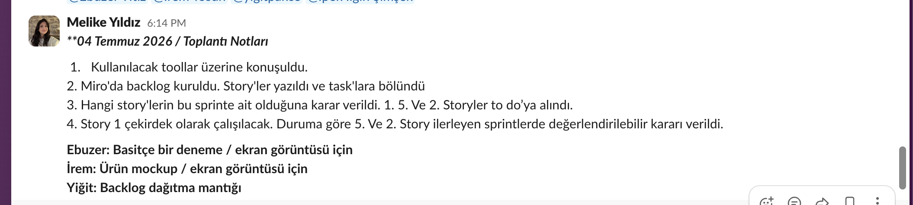

# Sprint 1

**Sprint tarihleri:** 19 Haziran 2026 – 5 Temmuz 2026
**Sprint hedefi:** Ürünü ve hedef kitleyi netleştirmek, Product Backlog'u kurmak ve ilk sprintin planlamasını tamamlamak. Bu sprint bir planlama ve kurulum sprintidir; geliştirmeye Sprint 2'de başlanacaktır.

---

## Sprint İçinde Tahmin Edilen Puan

- Product Backlog toplam puanı: **29 puan** (10 story)
- Sprint başına hedef: toplam puanın yaklaşık üçte biri, ~10 puan
- **Puan tamamlama mantığı:** Toplam puan 3 sprinte bölünerek sprint başına hedef belirlenmiştir. Sprint 1 bir planlama sprinti olduğundan bu sprintte geliştirme puanı tamamlanmamış, ürünün temeli atılmıştır. Seçilen çekirdek story (Story 1) Sprint 2'de geliştirilecektir.

## Backlog Dağıtma Mantığı

Product Backlog'umuz, ürünün ihtiyaç duyacağı işlerin önem sırasına göre dizilmesiyle oluşturulmuştur. Ürünün çekirdek değerini oluşturan story'ler (transkriptten özet, görev listesi ve takip maili üretme) listenin en üstüne konmuş; kolaylık ve ek özellikler (ses yükleme, geçmiş kayıtlar, dil seçimi) alt sıralara bırakılmıştır.

Her story'ye, işin birbirine göre zorluğunu gösteren kaba bir puan verilmiştir (1 en kolay, 8 en zor). Puanlamada saat değil, story'lerin göreceli büyüklüğü esas alınmıştır. Story başına verilen puan, toplam puanın yarısından az tutulacak şekilde işler yeterince küçük parçalara bölünmüştür.

Her story, yapılacak somut işlere (task'lara) ayrılmıştır. Miro Board'da mavi kartlar story'leri, kırmızı kartlar ise o story'lere bağlı task'ları temsil etmektedir. Sprint başında seçilen story'lerin task'ları "To Do" sütununa alınmış, iş ilerledikçe "In Progress" ve "Done" sütunlarına taşınacak şekilde bir Sprint Board kurulmuştur.

### Product Backlog (özet)

| # | Story | Puan |
|---|-------|------|
| 1 | Transkript yapıştırıp özet alma *(çekirdek)* | 3 |
| 2 | Görev listesi çıkarma *(çekirdek)* | 3 |
| 3 | Müşteriye takip maili üretme *(çekirdek)* | 3 |
| 4 | Sonraki toplantı gündemi üretme | 2 |
| 5 | Ses dosyası yükleyip metne çevirme | 5 |
| 6 | Çıktıları düzenleyip kopyalama | 2 |
| 7 | Toplantı türüne göre özelleştirme *(farklılaştırıcı)* | 3 |
| 8 | Geçmiş toplantıları görüntüleme | 3 |
| 9 | Çıktı dili seçme (TR/EN) | 2 |
| 10 | Hesap oluşturma ve giriş | 3 |

**Product Backlog (Miro):** [Miro Board](https://miro.com/app/board/uXjVH-qS2yM=/?share_link_id=828504705814)

### Bu Sprinte Seçilen Story'ler

Sprint Planning'de To Do'ya alınan story'ler: **Story 1, 2 ve 5.**
Çekirdek olarak **Story 1 (transkript → özet)** belirlenmiştir; çalıştığı takdirde Story 2 (görev dağılımı) eklenecektir. Story 5 (ses → transkript), bir kolaylık özelliği olduğundan ilerleyen sprintlere bırakılmıştır. Gerçek geliştirme Sprint 2'de yapılacaktır.

## Daily Scrum

Daily Scrum toplantıları, ekip üyelerinin farklı saatlerde müsait olması nedeniyle Slack üzerinden yazılı olarak yürütülmektedir. Her üye günlük olarak "dün ne yaptım, bugün ne yapacağım, önümde engel var mı" sorularını yanıtlamaktadır.

**4 Temmuz 2026 — Sprint Planning Notları**
- Kullanılacak araçlar (no-code platformu ve AI API'leri) üzerine konuşuldu.
- Miro'da Product Backlog kuruldu; story'ler yazılıp task'lara bölündü.
- Bu sprinte aday story'ler To Do'ya alındı: Story 1, 2 ve 5.
- Çekirdek olarak Story 1 (transkript → özet) belirlendi; çalışırsa Story 2 eklenecek.
- Story 5 (ses → transkript) ilerleyen sprintlere, kolaylık özelliği olarak bırakıldı.

Daily Scrum konuşmalarının ekran görüntüleri:

<!-- Slack ekran görüntülerini buraya ekleyin -->

## Sprint Board Update

Sprint board ekran görüntüsü (Product Backlog + To Do / In Progress / Done):

<!-- Miro board ekran görüntüsünü buraya ekleyin -->

## Ürün Durumu

Bu sprint sonunda ürünün ilk ekran tasarımı (mockup) hazırlanmıştır. Ekranda kullanıcı toplantı transkriptini yapıştırır ve ürün özet, görev listesi, takip maili ve sonraki toplantı gündemini üretir.

<!-- Mockup ekran görüntüsünü buraya ekleyin (mockup.html dosyasından alınabilir) -->

## Sprint Review

Bu sprint bir planlama ve kurulum sprinti olarak geçmiştir. Sprint boyunca yapılanlar:

- Ürün fikri ve hedef kitle netleştirildi (ajans ve freelancer'ların müşteri toplantıları).
- GitHub reposu açıldı ve public yapıldı.
- Product Backlog oluşturuldu: 10 story yazıldı, puanlandı ve task'lara bölündü.
- Sprint Board kuruldu ve bu sprintin story'leri seçildi.
- Ürünün ilk ekran mockup'ı hazırlandı.

**Tamamlanan:** Planlama, backlog kurulumu ve ilk tasarım.
**Sonraki sprinte taşınan:** Çekirdek geliştirme (Story 1 → transkript → özet) Sprint 2'de başlayacaktır.
**Katılımcılar:** İpek Ilgın Şimşek, Melike Yıldız, Ebuzer Yitiz, İrem Tosun, Yiğit Pakçe.

## Sprint Retrospective

**İyi giden:**
- [Ekip birer cümle ekleyecek — ör. "Backlog ve roller hızlıca netleşti."]

**Geliştirilebilecek:**
- [Ör. "Sürece daha erken başlamalıydık."]

**Sonraki sprint için aksiyonlar:**
- Sprint 2'de Story 1'in (transkript → özet) çalışan ilk versiyonunu çıkarmak.
- Seçilen no-code aracı ve AI API'si ile küçük bir fizibilite denemesi yapmak.
- [Ekip ekleyecek]
