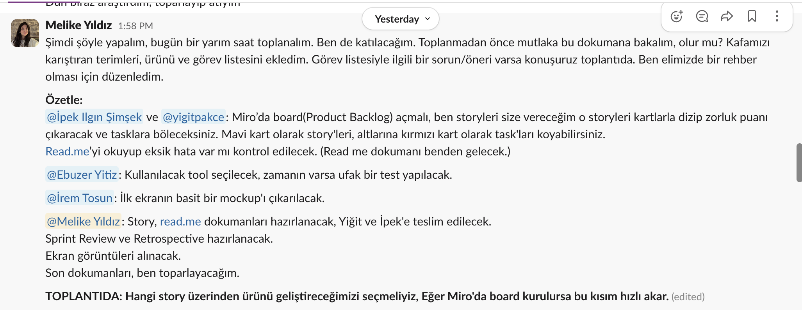
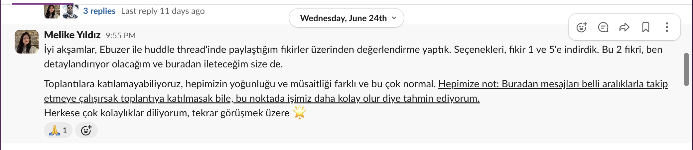
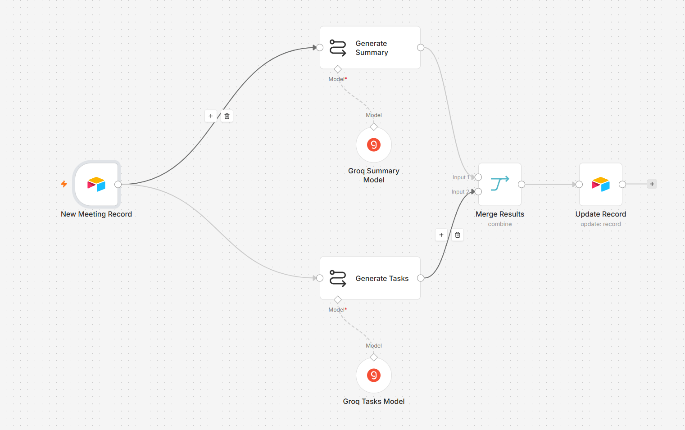
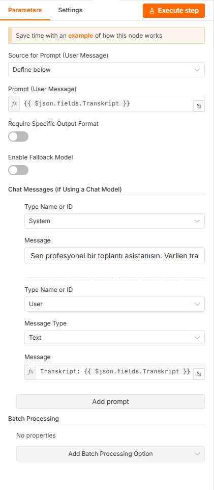
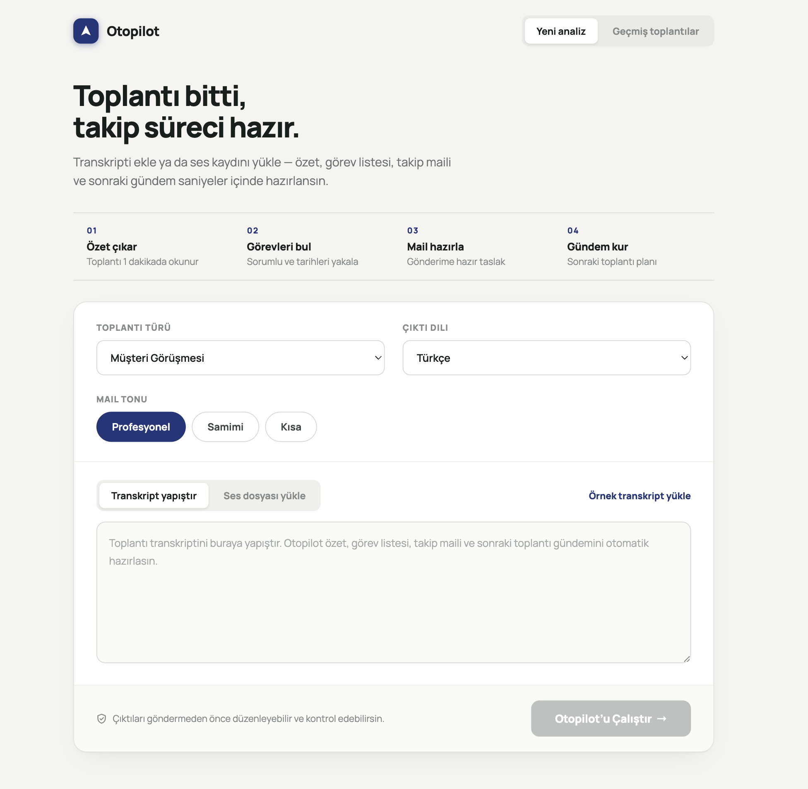
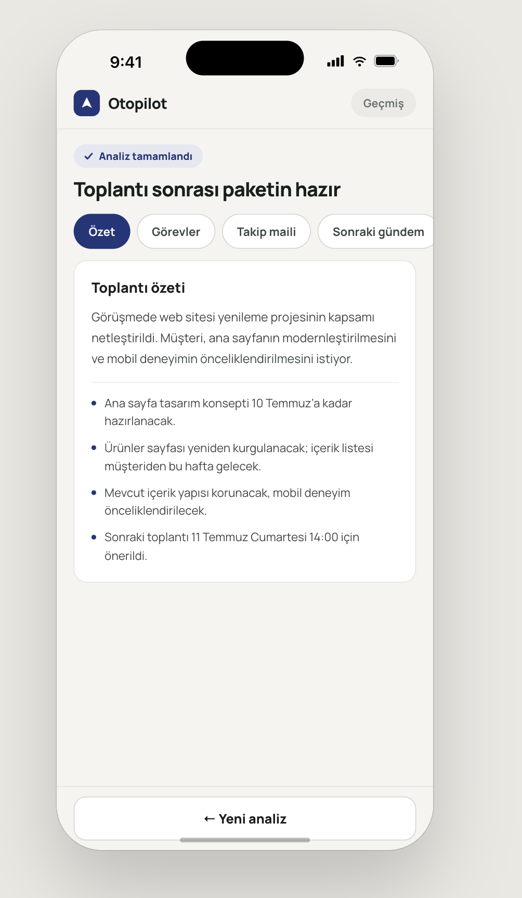
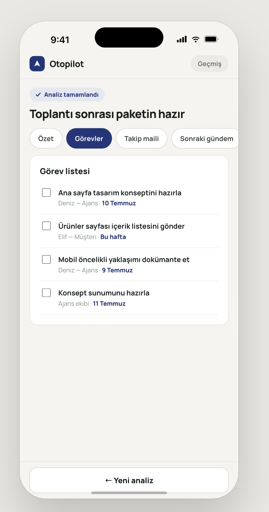
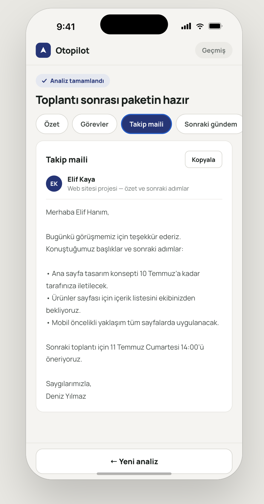
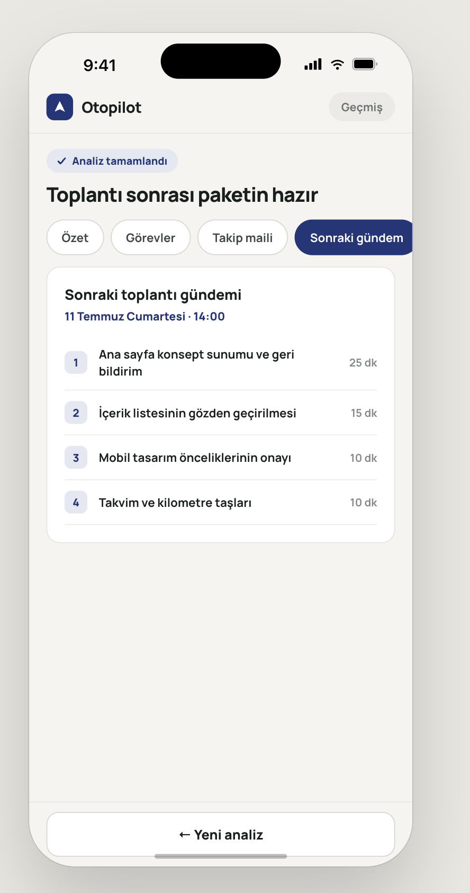
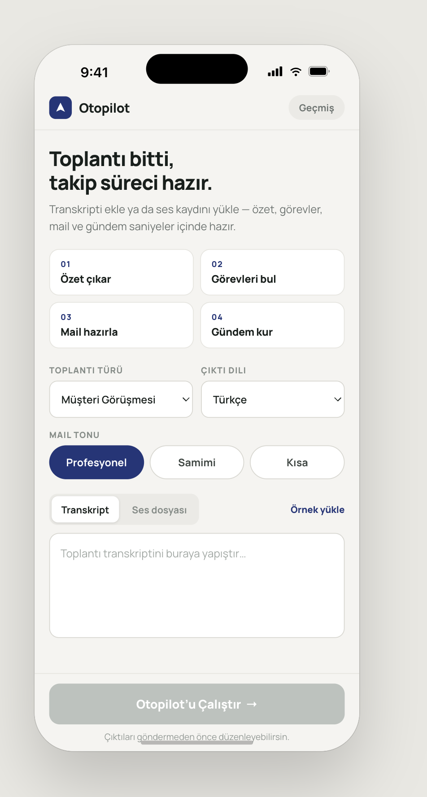

# Sprint 1

**Sprint tarihleri:** 19 Haziran 2026 – 5 Temmuz 2026
**Sprint hedefi:** Ürünü ve hedef kitleyi netleştirmek, Product Backlog'u kurmak, arayüz tasarımlarını ve toplantı-sonrası otomasyon akışının ilk versiyonunu hazırlamak.

---

## Sprint İçinde Tahmin Edilen Puan

- Product Backlog toplam puanı: **16 puan** (5 story)
- Sprint başına hedef: toplam puanın yaklaşık üçte biri, ~5 puan
- **Puan tamamlama mantığı:** Toplam puan 3 sprinte bölünerek sprint başına hedef belirlenmiştir. Sprint 1'de ürünün temeli atılmış; planlama, tasarım ve otomasyon akışının ilk versiyonu tamamlanmıştır.

## Backlog Dağıtma Mantığı

Product Backlog'umuz, ürünün ihtiyaç duyacağı işlerin önem sırasına göre dizilmesiyle oluşturulmuştur. Ürünün çekirdek değerini oluşturan story'ler (transkriptten özet, görev listesi ve takip maili üretme) listenin en üstüne konmuş; ek özellikler (sonraki toplantı gündemi, ses yükleme) alt sıralara bırakılmıştır.

Her story'ye, işin birbirine göre zorluğunu gösteren kaba bir puan verilmiştir (1 en kolay, 8 en zor). Puanlamada saat değil, story'lerin göreceli büyüklüğü esas alınmıştır.

Her story, yapılacak somut işlere (task'lara) ayrılmıştır. Miro Board'da mavi kartlar story'leri, kırmızı kartlar ise o story'lere bağlı task'ları temsil etmektedir.

### Product Backlog

| # | Story | Puan |
|---|-------|------|
| 1 | Transkript yapıştırıp özet alma *(çekirdek)* | 3 |
| 2 | Görev listesi çıkarma *(çekirdek)* | 3 |
| 3 | Müşteriye takip maili üretme *(çekirdek)* | 3 |
| 4 | Sonraki toplantı gündemi üretme | 2 |
| 5 | Ses dosyası yükleyip metne çevirme | 5 |

**Product Backlog (Miro):** [Miro Board](https://miro.com/app/board/uXjVH-qS2yM=/?share_link_id=828504705814)

### Bu Sprinte Seçilen Story'ler

Sprint Planning'de To Do'ya alınan story'ler: **Story 1, 2 ve 5.** Çekirdek olarak **Story 1 (transkript → özet)** belirlenmiştir.

## Daily Scrum

Daily Scrum toplantıları, ekip üyelerinin farklı saatlerde müsait olması nedeniyle Slack üzerinden yazılı olarak yürütülmektedir. Ekip, huddle ve mesajlar üzerinden fikirleri değerlendirmiş, seçenekleri Story 1 ve 5'e indirmiştir.

**24 Haziran 2026 — Slack Notu (özet)**
- Ebuzer ile huddle'da fikirler değerlendirildi; seçenekler fikir 1 ve 5'e indirildi.
- Bu iki fikir detaylandırılıp ekiple paylaşılacak.
- Toplantıya katılamayan üyeler için Slack mesajları düzenli takip edilecek.

Daily Scrum ve ekip iletişimi ekran görüntüleri:

## Sprint Board Update

Sprint board, Miro üzerinde Product Backlog ve To Do / In Progress / Done sütunlarıyla yürütülmektedir. Güncel board yukarıdaki Product Backlog (Miro) bağlantısından görülebilir.

## Ürün Durumu

Bu sprintte ürünün arayüz tasarımları ve toplantı-sonrası otomasyon akışının ilk versiyonu hazırlandı. Kullanıcı toplantı transkriptini yapıştırır; ürün özet, görev listesi, takip maili ve sonraki toplantı gündemini otomatik üretir.

### Otomasyon Akışı (n8n + Groq)

Yeni toplantı kaydı alınır, özet ve görevler Groq AI modelleriyle paralel üretilir, sonuçlar birleştirilip kayda yazılır.

### Arayüz Tasarımları

**Ana ekran (masaüstü)**

**Sonuç ekranları (mobil)**

<table>
<tr>
<td align="center"> <b>Özet</b></td>
<td align="center"> <b>Görevler</b></td>
<td align="center"> <b>Takip maili</b></td>
<td align="center"> <b>Sonraki gündem</b></td>
</tr>
</table>

**Giriş ekranı (mobil)**

## Sprint Review

Bu sprint bir planlama, tasarım ve kurulum sprinti olarak geçmiştir. Sprint boyunca yapılanlar:

- Ürün fikri ve hedef kitle netleştirildi (ajans ve freelancer'ların müşteri toplantıları).
- GitHub reposu açıldı ve public yapıldı.
- Product Backlog oluşturuldu: 5 story yazıldı, puanlandı ve task'lara bölündü.
- Ürünün arayüz tasarımları (masaüstü + mobil, tüm sonuç ekranları) hazırlandı.
- n8n + Groq ile toplantı-sonrası otomasyon akışının ilk versiyonu kuruldu.

**Katılımcılar:** İpek Ilgın Şimşek, Melike Yıldız, Ebuzer Yitiz, İrem Tosun, Yiğit Pakçe.

## Sprint Retrospective

**İyi giden:**
- Ürün fikri hızlıca netleşti ve seçenekler iki güçlü fikre indirildi.
- Arayüz tasarımları ve otomasyon akışının ilk versiyonu kısa sürede ortaya çıktı.

**Geliştirilebilecek:**
- Sürece daha erken başlanabilirdi; işlerin bir kısmı sprint sonuna yığıldı.
- Ekip içi eşzamanlı çalışma yerine asenkron iletişime daha çok yaslanıldı.

**Sonraki sprint için aksiyonlar:**
- Otomasyon akışını gerçek transkriptle uçtan uca test etmek.
- Story 1'in (transkript → özet) çalışan ilk versiyonunu çıkarmak.
- Tasarımları çalışan arayüze bağlamak.
