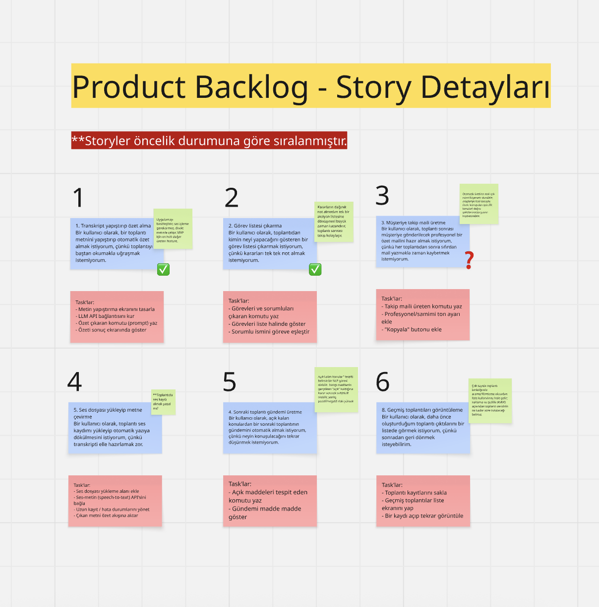
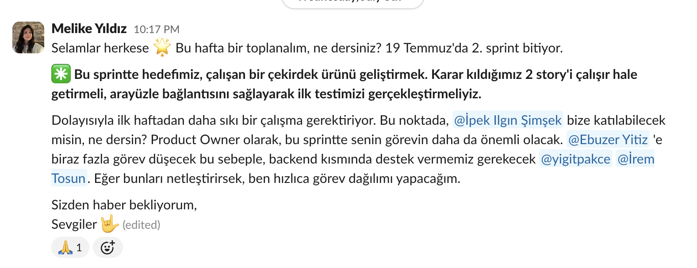
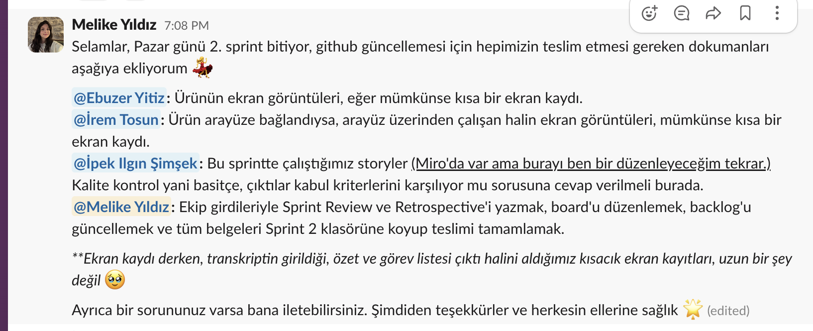
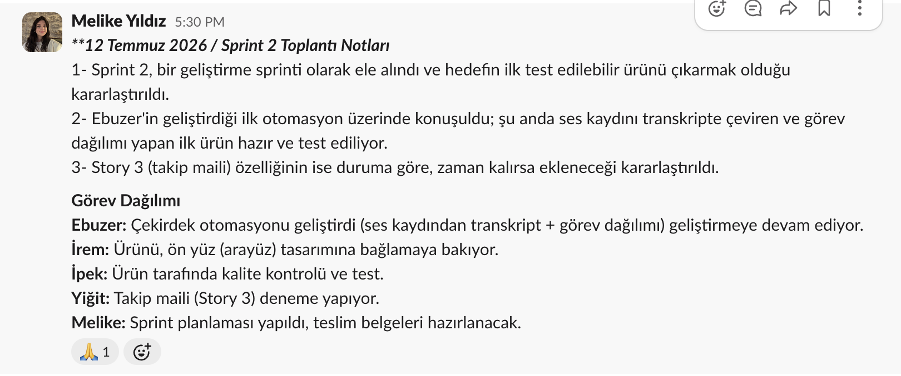
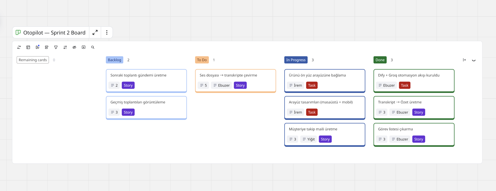

# Sprint 2

**Sprint tarihleri:** 6 Temmuz 2026 – 19 Temmuz 2026
**Sprint hedefi:** Çalışan bir çekirdek ürün ortaya çıkarmak. Kullanıcı bir toplantı transkriptini (veya ses kaydını) verdiğinde, ürünün gerçekten özet ve sorumlusuyla birlikte görev listesi üretmesi hedeflenmiştir. Sprint 1 planlama ve tasarım sprintiyken, Sprint 2 bir geliştirme sprinti olarak yürütülmüştür.

---

## Sprint İçinde Tahmin Edilen Puan

- Bu sprint için hedeflenen puan: **~9 puan** (Story 1, 2 ve 3)
- Sprintte tamamlanan puan: **11 puan** (Story 1, 2 ve 5)
- **Puan tamamlama mantığı:** Toplam 16 puanlık backlog 3 sprinte bölünmüştür. Sprint 1 planlama sprinti olduğu için geliştirme puanı içermiyordu; asıl geliştirme puanı bu sprintte toplanmıştır. Story 3 (takip maili) bu sprintte başlanmış ancak tamamlanamamış, Sprint 3'e bırakılmıştır.

## Bu Sprintte Alınan Teknik Kararlar

**Otomasyon platformu n8n'den Dify'a taşındı.** Sprint 1'de akışın ilk versiyonu n8n üzerinde prototiplenmişti. Bu sprintte, ekip olarak geliştirmeye Dify üzerinden devam etme kararı alınmıştır. Dify'ın LLM adımlarını, koşullu dallanmayı ve hazır Web App / Service API desteğini tek yerde sunması, ürünü hem geliştirmek hem de dışarıya açmak açısından daha pratik bulunmuştur. Akış Dify'da bir Chatflow olarak yeniden kurulmuş ve Dify Cloud'a taşınmıştır.

## Backlog Dağıtma Mantığı

Product Backlog, ürünün çekirdek değerini oluşturan story'ler en üstte olacak şekilde önem sırasına göre dizilmiştir. Her story'ye işin göreceli zorluğunu gösteren kaba bir puan verilmiş, story'ler yapılacak somut işlere (task'lara) bölünmüştür. Miro'daki Product Backlog panosunda mavi kartlar story'leri, kırmızı kartlar ise o story'lere bağlı task'ları göstermektedir.

### Product Backlog ve Sprint Sonu Durumu

| # | Story / Task | Puan | Sorumlu | Durum |
|---|--------------|------|---------|-------|
| 1 | Transkript → Özet üretme | 3 | Ebuzer | Done |
| 2 | Görev listesi çıkarma | 3 | Ebuzer | Done |
| 5 | Ses dosyası → transkripte çevirme | 5 | Ebuzer | Done |
| — | Otomasyon akışının Dify üzerinde kurulması | — | Ebuzer | Done |
| 3 | Müşteriye takip maili üretme | 3 | Yiğit | In Progress |
| — | Arayüz tasarımları (masaüstü + mobil) | — | İrem | In Progress |
| — | Ürünü ön yüz arayüzüne bağlama | — | İrem | In Progress |
| 4 | Sonraki toplantı gündemi üretme | 2 | — | Backlog |
| 7 | Toplantı türüne göre özelleştirme | 3 | — | Backlog |
| 8 | Geçmiş toplantıları görüntüleme | 3 | — | Backlog |

**Product Backlog (Miro):** [Miro Board](https://miro.com/app/board/uXjVH-qS2yM=/?share_link_id=828504705814)

## Toplantı ve Daily Scrum Notları

Ekip iletişimi Slack üzerinden yürütülmüş, haftalık toplantılarla ilerleme değerlendirilmiştir.

**12 Temmuz 2026 — Sprint 2 Haftalık Toplantı Notları**
- Sprint 2 bir geliştirme sprinti olarak ele alındı; hedefin ilk test edilebilir ürünü çıkarmak olduğu kararlaştırıldı.
- Ebuzer'in geliştirdiği ilk otomasyon üzerinde konuşuldu.
- Otomasyonun n8n yerine Dify üzerinden geliştirilmesine karar verildi.
- Ses kaydını transkripte çeviren ve görev dağılımı yapan ilk ürün hazır hale geldi ve test edilmeye başlandı.
- Story 3 (takip maili) özelliğinin duruma göre, zaman kalırsa ekleneceği kararlaştırıldı.

**Görev dağılımı:** Ebuzer çekirdek otomasyonu geliştirdi ve geliştirmeye devam ediyor, İrem ürünü ön yüz tasarımına bağlıyor, İpek ürün tarafında kalite kontrolü ve test yapıyor, Yiğit takip maili (Story 3) üzerinde deneme yapıyor, Melike sprint planlaması ve teslim belgelerinden sorumlu.

Slack üzerinden yürütülen ekip iletişimi ve toplantı notları:

## Sprint Board Update

Sprint board Miro üzerinde, Backlog / To Do / In Progress / Done sütunlarıyla yürütülmektedir. Kartlarda puan, sorumlu ve story/task etiketi yer almaktadır.

## Ürün Durumu

Bu sprintte ürünün çalışan ilk versiyonu ortaya çıkmıştır.

**Otomasyon (Dify + Groq):** Toplantı-sonrası akış Dify üzerinde bir Chatflow olarak kurulmuştur. Akış, kullanıcının ses dosyası yüklemesi durumunda Groq'un transkripsiyon servisiyle kaydı yazıya döker; metin girildiğinde ise doğrudan analiz eder. Ardından LLM adımı toplantı özetini ve sorumlularıyla birlikte görev listesini üretir. Uygulama Dify Cloud'a taşınmış, Web App ve Service API yayına alınmıştır.

**Arayüz:** Ürünün masaüstü ve mobil arayüz tasarımları hazırlanmıştır (giriş ekranı, özet, görev listesi, takip maili ve sonraki gündem ekranları). Arayüzün otomasyona bağlanması çalışması bu sprintte başlamış olup Sprint 3'te tamamlanacaktır.

<!-- Çalışan ürünün ekran görüntülerini / kısa ekran kaydını images klasörüne yükleyip buraya ekleyin -->

## Sprint Review

- Otomasyon platformu olarak Dify'a geçilmesine karar verildi ve akış Dify üzerinde yeniden kuruldu.
- Ses kaydından transkripte çevirme (Story 5) tamamlandı.
- Transkriptten özet üretme (Story 1) tamamlandı.
- Sorumlusuyla birlikte görev listesi çıkarma (Story 2) tamamlandı.
- Uygulama Dify Cloud'a taşındı; Web App ve Service API yayına alındı.
- Masaüstü ve mobil arayüz tasarımları hazırlandı.
- **Tamamlanamayan:** Arayüzün otomasyona bağlanması ve Story 3 (takip maili) Sprint 3'e taşınmıştır.

**Katılımcılar:** İpek Ilgın Şimşek, Melike Yıldız, Ebuzer Yitiz, İrem Tosun, Yiğit Pakçe.

## Sprint Retrospective

**İyi giden:**
- Çekirdek ürün planlanandan hızlı çıktı; özet ve görev listesi üretimi sprint ortasında çalışır hale geldi.
- Platform değişikliği (n8n → Dify) erken alındığı için geliştirme sekteye uğramadı; Dify Cloud'a taşınması ekibin ortak erişimini kolaylaştırdı.

**Geliştirilebilecek:**
- Arayüz ve otomasyon geliştirmesi paralel ilerledi ama entegrasyon planı sprint başında netleştirilmemişti; bağlantı işi sprint sonuna kaldı.
- Model sağlayıcı ve API anahtarı gibi teknik bağımlılıklar tek kişide toplandığı için bazı adımlarda beklemek gerekti.

**Sonraki sprint için aksiyonlar:**
- Arayüzü otomasyona bağlayıp ürünü uçtan uca çalışır hale getirmek.
- Story 3'ü (takip maili) tamamlamak.
- Erişim ve anahtar paylaşımını baştan netleştirerek tek kişiye bağımlılığı azaltmak.
